# Technical Architecture Diagram

```mermaid
flowchart TB
    subgraph "User Interface Layer"
        GF1[Google Form<br/>Phase 1]
        GF2[Google Form<br/>Phase 2]
    end
    
    subgraph "Google Apps Script Layer"
        Dispatcher[onAnyFormSubmit<br/>Event Dispatcher]
        P1Handler[handlePhase1]
        P2Handler[handlePhase2]
        Classifier[classifyClientProfile<br/>FromWorkingSheet]
        Engine[runUniversalEngine]
        
        subgraph "Profile Helpers"
            PH1[1_ROBS_In_Use]
            PH2[2_ROBS_Curious]
            PH3[3_Solo401k_Builder]
            PH4[4_Roth_Reclaimer]
            PH5[5_Bracket_Strategist]
            PH6[6_Catch_Up]
            PH7[7_Foundation_Builder]
            PH8[8_Biz_Owner_Group]
            PH9[9_Late_Stage_Growth]
        end
        
        subgraph "Universal Functions"
            HSA[calculateHsaMonthlyCapacity]
            CESA[calculateCesaMonthlyCapacity]
            EMP401K[addEmployer401kVehicles]
            ROTH[applyRothIRAPhaseOut]
            TAXPREF[Tax Preference Functions]
        end
        
        subgraph "Core Allocation"
            NetPool[computeNetPool]
            Domains[computeDomainsAndWeights]
            Allocate[coreAllocate]
        end
    end
    
    subgraph "Data Layer"
        subgraph "Google Sheets"
            WS[Working Sheet<br/>Main Database]
            FR1[Form Responses 1<br/>Phase 1 Raw Data]
            RP2[RawPhase2<br/>Phase 2 Raw Data]
            FIN[Financial<br/>Student Tracking]
            TEST[TestData<br/>Testing Only]
        end
    end
    
    subgraph "External Services"
        Gmail[Gmail API<br/>Email Notifications]
        Forms[Google Forms API<br/>Form Management]
        ExtLib[FinancialTruPath<br/>Function Library]
    end
    
    %% User Flow
    GF1 -->|Submit| FR1
    FR1 -->|Trigger| Dispatcher
    Dispatcher -->|Route| P1Handler
    P1Handler -->|Copy Data| WS
    P1Handler -->|Track| FIN
    P1Handler -->|Call| Classifier
    Classifier -->|Update| WS
    P1Handler -->|Send Email| Gmail
    
    GF2 -->|Submit| RP2
    RP2 -->|Trigger| Dispatcher
    Dispatcher -->|Route| P2Handler
    P2Handler -->|Copy Data| WS
    P2Handler -->|Call| Engine
    
    %% Engine Flow
    Engine -->|Select Helper| PH1
    Engine -->|Select Helper| PH2
    Engine -->|Select Helper| PH3
    Engine -->|Select Helper| PH4
    Engine -->|Select Helper| PH5
    Engine -->|Select Helper| PH6
    Engine -->|Select Helper| PH7
    Engine -->|Select Helper| PH8
    Engine -->|Select Helper| PH9
    
    PH1 -->|Use| HSA
    PH1 -->|Use| CESA
    PH1 -->|Use| EMP401K
    PH1 -->|Use| ROTH
    PH1 -->|Use| TAXPREF
    
    Engine -->|Calculate| NetPool
    Engine -->|Prioritize| Domains
    Engine -->|Run| Allocate
    Allocate -->|Write Results| WS
    
    %% External Connections
    P1Handler -.->|Uses| ExtLib
    Forms -.->|Manage| GF1
    Forms -.->|Manage| GF2
    
    style GF1 fill:#e6f3ff
    style GF2 fill:#e6f3ff
    style WS fill:#ffe6e6
    style Engine fill:#fff4e6
    style Gmail fill:#e6ffe6
```

## Architecture Components

### User Interface Layer
- **Google Forms**: Automated forms for data collection
- **Phase 1**: Initial assessment (auto-generated from config)
- **Phase 2**: Profile-specific deep dive (9 different versions)

### Processing Layer (Google Apps Script)
- **Event Dispatcher**: Routes form submissions to appropriate handlers
- **Phase Handlers**: Process submissions and coordinate workflow
- **Classification Engine**: Determines user profile based on rules
- **Allocation Engine**: Core optimization algorithm
- **Profile Helpers**: Profile-specific business logic (9 variants)
- **Universal Functions**: Shared calculations (HSA, CESA, taxes)

### Data Layer (Google Sheets)
- **Working Sheet**: Central database with all user data
- **Form Responses**: Raw submission data
- **Financial Sheet**: Student tracking and attendance
- **Test Data**: Development and testing dataset

### External Services
- **Gmail API**: Automated email notifications
- **Google Forms API**: Dynamic form management
- **External Library**: Shared utility functions

## Data Flow Sequence

1. **Form Submission** → Sheets → Trigger Event
2. **Event Dispatcher** → Route to Handler
3. **Handler** → Process & Store Data
4. **Classification** → Determine Profile
5. **Engine** → Run Optimization
6. **Results** → Write to Database
7. **Notifications** → Email User