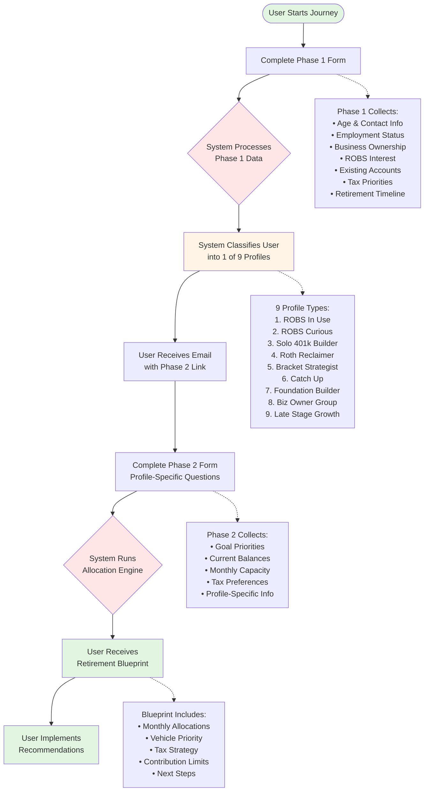

# User Journey Flowchart

## User Journey Steps Explained

### 1. **Start Journey**
User initiates the retirement planning process, typically through a course or advisor referral.

### 2. **Phase 1 Form**
Initial assessment to understand basic situation and determine appropriate planning profile.

### 3. **Profile Classification**
Automated system analyzes responses and assigns user to most appropriate profile.

### 4. **Email Notification**
Personalized email with Phase 2 form link pre-filled with user's identifier.

### 5. **Phase 2 Form**
Detailed questionnaire specific to assigned profile for precise optimization.

### 6. **Allocation Engine**
Complex calculations considering limits, taxes, and preferences to optimize strategy.

### 7. **Receive Blueprint**
Comprehensive retirement savings strategy with specific monthly allocation amounts.

### 8. **Implementation**
User takes action based on recommendations to optimize retirement savings.